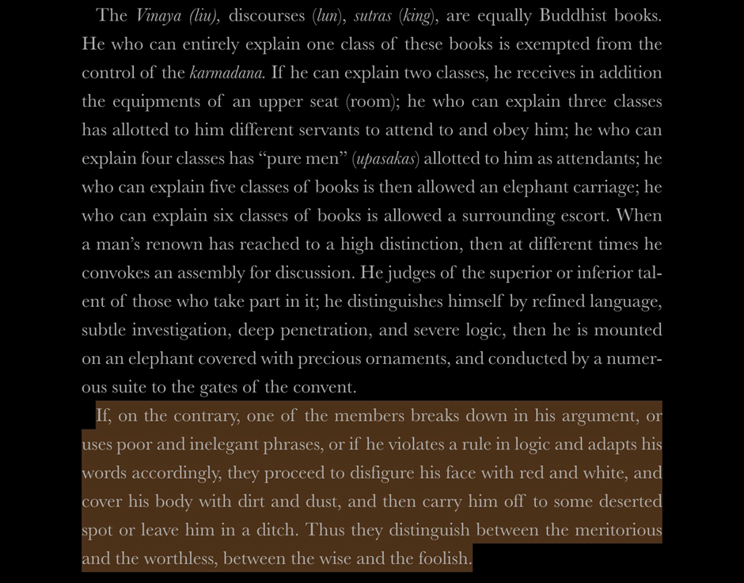

## tropes about Indian culture

Common themes:

·       Honest men

·       Chaste women

·       Long lives

·       Low crime

·       Tall, handsome/good-looking

·       Good steel [[1](https://twitter.com/TheEmissaryCo/status/1552671867118538752)]

·       Brave soldiers

·       Rarely invaded or invaded anyone else

·       Insular

Some Hindu king had perished at the hand of an enemy of his who had marched against him from our country. After his death there was born a child to him, which succeeded him, by the name of Sagara. On coming of age, the young man asked his mother about his father, and then she told him what had happened. Now he was inflamed with hatred, marched out of his country into the country of the enemy, and plentifully satiated his thirst of vengeance upon them. After having become tired of slaughtering, he compelled the survivors to dress in our dress, which was meant as an ignominious punishment for them. When I heard of it, I felt thankful that he was gracious enough not to compel us to Indianise ourselves and to adopt Hindu dress and manners....

[https://www.wisdomlib.org/hinduism/book/kathasaritsagara-the-ocean-of-story/d/doc118769.html](https://www.wisdomlib.org/hinduism/book/kathasaritsagara-the-ocean-of-story/d/doc118769.html) -- intellectual swayamvara

### Re: Medieval Revivals in the West

Iran

[https://twitter.com/Peter_Nimitz/status/1659693526270222337](https://twitter.com/Peter_Nimitz/status/1659693526270222337)

Ballad of King Vahram

[https://twitter.com/DalrympleWill/status/1314882027951468551](https://twitter.com/DalrympleWill/status/1314882027951468551)

[https://twitter.com/DalrympleWill/status/1314885010688745472](https://twitter.com/DalrympleWill/status/1314885010688745472)

Chanakya sources

[https://twitter.com/Sapratha/status/1603391621693046786](https://twitter.com/Sapratha/status/1603391621693046786)

[https://twitter.com/Sapratha/status/1603385883712856064](https://twitter.com/Sapratha/status/1603385883712856064)

[https://twitter.com/satoverma/status/1549774819130224641](https://twitter.com/satoverma/status/1549774819130224641)

Kshatriyas becoming Brahmins Brahmanda Purana 3.66:86a-90

[https://www.wisdomlib.org/hinduism/book/the-brahmanda-purana/d/doc362924.html](https://www.wisdomlib.org/hinduism/book/the-brahmanda-purana/d/doc362924.html)