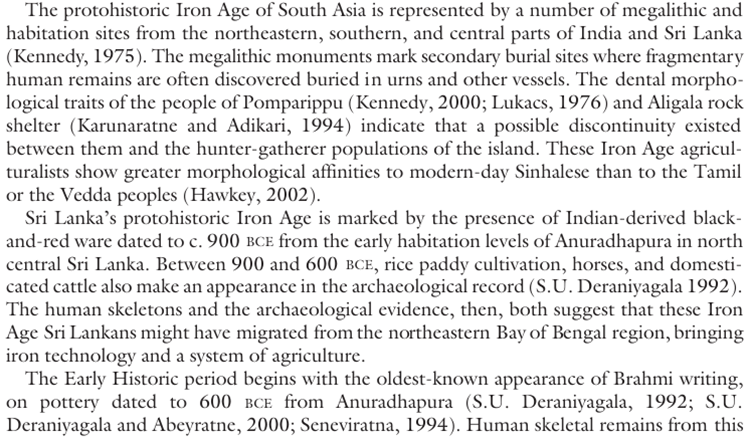

# Early Iron Age Indian influences on the Mideast

This piece is speculative. The patterns and analogies pointed out are real, we can say with confidence that _some_ relationship existed, and the Axial age certainly began earliest in India, but the precise relationships I hypothesize are my own pet theories, and are less certain. Do not take them for fact – I state my own level of belief in each claim I make.

### Pythagoras

When you read of Pythagoras (570 – 495 BC) and his school, it is impossible to not see an Indian influence: in the topics they studied, which were closely similar to the sciences of emphasis in Indian study since a few centuries earlier than his time (geometry especially his eponymous theorem itself, musical tuning, medicine), in their philosophy (transmigration/reincarnation – specifically as being related to the breath, numerology/Sāṃkhya, perhaps also the classical elements), and in the way of life in their academy (vegetarianism, ascetism, ritual purity, perhaps also psychedelic experiences)[[i]](#_edn1).  

It is well-documented that Pythagoras travelled extensively, but early accounts only discuss his travels in Egypt and Babylon; much later accounts from the Roman era claim that he based much of his philosophy on that of the Indians.[[ii]](#_edn2)

I wouldn’t really postulate that Pythagoras travelled to India himself: there are a number of such men of his time, responsible for building Classical Greek civilization, all reputed to have travelled extensively in the Levant, and vaguely similar themes are seen also among the Orphics, Empedocles, and Thales of Miletus except unlike Pythagoras, the main influence on them were Egyptian and Babylonian.[[iii]](#_edn3) It seems unlikely to suggest that all of these guys travelled to India and didn’t bother writing about travelling to what they saw as the edge of the world.

**My take:** I find it more likely that there were colonies of Brahmin and Ajivika scholars in the Levant and Egypt – and Pythagoras in particular was more influenced by them more than he was by the other schools (a story that would repeat itself 1700 years later). Credence for earlier Indian math having had an influence on Pythagoras: 75%, conditional credence for Indian scholars in Egypt/Babylon rather than some other medium of tranmission: 75%.

### Re: The Great Urbanization of the 8th Century BC

Well, what were these Iron Age Indians doing in the Middle East?

I have long found issue with the mainstream theory of the origin of Brahmi [context in an endnote[[iv]](#_edn4)], that it is derived from Aramaic. The problem is that Brahmi characters often better match Aramaic’s parent Phoenician or its many sibling scripts:

Ignoring the right-to-left shenanigans, four characters (labelled here with their Aramaic names Dalath, Zain, Ayin, Sadhe) best match Phoenician, four (He, Waw, Kheth, Iodh) best match other Near Eastern scripts, and one (Beth) best matches Proto-Sinaitic, the ancestor of Phoenician that wasn’t in use by the time. The others could fit any of the scripts; none of them really show a preference for Aramaic.

This leads me to believe that the Brahmi script was developed with knowledge of several different Phoenician-derived scripts in the Levant – probably by early Indian scholars or merchants who travelled to the Levant. It is not hard to imagine that like in the case of Greece, the men who built Indian civilization were well-travelled, or in contact with those who were well-travelled – early philosophers like Yajnavalkya and Uddalaka Aruni _are_ described in this way (although only their travels as far as Gandhara are detailed), and 4th century BC Jain and Buddhist scriptures mention their respective prophets as having been familiar with various mysteriously-named (except 1, 2, 4, 13, 14, 17, 18 – but even these it is not clear what the scripts refer to) scripts:

Source[[v]](#_edn5). This would also imply Brahmi to have a more ancient origin (9th – 6th century BC) than is believed by historians. I think this is consistent with archaeological evidence from Sri Lanka, where Brahmi inscriptions at Anuradhapura have found on pottery dating to the 6th century BC – and the earliest portions of the Anuradhapura citadel itself are dated to any period between the 9th – 6th century BC [[vi]](#_edn6). Perhaps this lends credence to the historicity of Rama’s Lanka expedition.

My guess is the Indian tradition – especially the Vedic tradition – continued to emphasize oral tradition for very long: writing existed, it was just _safe, legal and rare_. This also explains the apparent contradictions in the later writings of Megasthenes in which he says on one hand that Indians wrote on cotton-paper and on the other hand that they were ignorant of writing and had no written laws.

Perhaps they travelled to the Levant by land, and Taxila became important due to its important location on this route[[vii]](#_edn7). Or perhaps they sailed there – contrary to popular misconception, the Vedic Indians were well-aware of seafaring from the Early Rig Vedic period itself[[viii]](#_edn8). Unfortunately little is known of the early history of Sindh and Gujarat.

There is some speculation on fringe blogs that the Paṇis, the term used in the Rig Veda to refer to the mercantile caste, were the Phoenicians. This is wrong – Paṇi seems cognate with Nordic Vanir, they are not known for their seafaring qualities, and in any case the Phoenicians did not refer to themselves as Phoenicians.

**My take:** I propose an alternate theory. I think that the well-known revival of lost Indus Valley traditions in the Second Urbanization: (ref[[ix]](#_edn9): e.g. similar standards of weights and length measures, similar symbols on coinage as on Indus Valley seals, the use of ivory dice, baked brick construction, bangles, generally similar craft industries, the Swastika symbol, Yoga and meditative practices, baths and stepwells) requires that these traditions must have survived in form, even if they were not followed by the priestly and royal classes associated with the composition of the Vedas. I think it is likely the Indus Valley Civilization was run by mercantile families, the Paṇis, who after the collapse still retained their cultures, and remained mercantile, even if they had lost their wealth and glory. The priestly and royal classes were adversarial to the mercantile class in early Vedic society, a trend which abruptly changes with the Second Urbanization. This newfound pro-capitalist attitude was probably the main cause of the Second Urbanization. Credence for “Mature phase of IVC was run by mercantile elite” – 85%; conditionally “the Paṇis descended from this elite” – 70%.

### Re: Ajivikas in Ethiopia

Some of the Ajivikas in Egypt may have travelled further down the Nile and settled the region then known as Ethiopia (mostly modern Sudan), as later Greek literature famously attests to a race of “gymnosophists” (naked philosophers) in Ethiopia descended from the Indian gymnosophists (Ajivikas).

The Pythagoreans remained fond of India for very long. Philostrasus writes the chilling tale of an “incredibly handsome” Indian king who ruled Ethiopia and brought great prosperity to the land, only to be assassinated by them – but turns out he was “the son of Ganga”, and the river (who is personified as male by the Greeks) avenges him and destroys the Ethiopians:

… the Ethiopians lived here, and were subject to King Ganges, and the land was sufficient for their sustenance, and the gods watched over them;

But when they slew this king, neither did the rest of the Indians regard them as pure, nor did the land permit them to remain upon it; for it spoiled the seed which they sowed in it before it came into ear, and it inflicted miscarriages on their women, and it gave a miserable feed to their flocks; and wherever they tried to found a city, it would give way sink down under their feet. Nay more, the ghost of Ganges drove them forward on their path, a haunting terror to their multitude, and it did not quit them until they atoned to earth by sacrificing the murderers who had shed the king's blood with their hands.

Now this Ganges it seems, was ten cubits high, and in personal beauty excelled any man the world had yet seen, and he was the son of the river Ganges; and when his own father inundated India, he himself turned the flood into the Red Sea, and effected a reconciliation between his father and the land, with the result that the latter brought forth fruits in abundance for him when living, and also avenged him after death.

[—Philostrasus, in the Life of Apollonius, 3.20, c. 200 AD](https://www.sacred-texts.com/cla/aot/laot/laot13.htm)

The story itself is very magical of course, and the Greeks wrongly thought that the Ganga river connected to the Nile River[[x]](#_edn10), but the concept of Indians settled in faraway regions coming to rule those lands is not unheard of, as we will see. Other writers have noted other cultural coincidences between India and Ethiopia in this period (such as the unique use of an abugida), lending credence to the tale[[xi]](#_edn11).

**My take:** It’s worth a note, but I would not attach too much credence to this tale. There are not so many gaps in the history of the Southern Nile in this period, unless the tale refers to a place even further South, e.g. the actual Ethiopia. 50% credence to Ajivikas being present in Sudan, 20% to an Indian ruler in North-Eastern Africa.

### Re: Comparative mythology

 Some of the most interesting coincidences of comparative mythology are between the Indian Epics and the Greek ones, which emerged before any known contact between the two civilizations but also cannot be attributed to any common Indo-European root: the Mahābhārata is analogous to the Iliad, the Rāmāyaṇa is analogous to the Odyssey, and the Hesoid’s Ages are similar to the Yugas.

It would not be impossible that these similarities are is coincidental: the most striking similarity between the Mahābhārata and the Iliad (Duryodhana’s thigh and Achilles’ heel), only appears much later on the Greek side, in Statius’s Achilleid (1st century), so this could have been the result of later contact. While there are other common themes (war over a woman, gods intervening and taking sides, large-scale alliances, hero’s reluctance to fight, betrayal of the notion of a fair fight, Kunti begging for her sons’ lives/Priam begging for his son’s corpse, the complete destruction in the aftermath of the war), it is possible that this was a result of common Indo-European heroic themes applied to correlated events (wars following from the Late Bronze Age Collapse). Similarly, the Yugas and Hesoid’s Ages could both be independent extrapolations of similar histories in both civilizations (complete social destruction in the Late Bronze Age Collapse, following an age of relative stagnation and poverty i.e. the Late Bronze Age, following a distant memory of a better past, i.e. the Early/Middle Bronze Age).

The similarity between the Rāmāyaṇa and the Odyssey is harder to explain this way – Penelope asking her suitors to string a bow seems to be closely related to the svayaṃvara practice, which isn’t otherwise attested outside India (“suitors” existed elsewhere, but the concept of a competition, especially involving archery, was pretty much just Indian) – this means that if there was a transmission, it would have been from India to Greece.

Some things that are often mentioned in this context – but my impression is that these contacts probably occurred earlier, in the Middle Bronze Age (remember: anything found archaeologically is only the earliest instance known to _you_, not the earliest instance in history):

·       [Some samples from Late Bronze Age Greece contain 5-10% Indian ancestry](https://eruditus.substack.com/p/indian-dna-in-the-greek-age-of-heroes) (many of these samples are Minoan, so don’t take this as evidence for some kind of OIT stuff)

·       Many plants native to Africa were first domesticated in Peninsular India around the Late Bronze Age and Early Iron Age, e.g. the black-eyed pea, the lablab, the pigeon pea (toor-dal), sorghum and millets. Ref[[xii]](#_edn12).

**My take:** Don’t have one. Confused.

### Re: Kamboja, Zoroastrianism and the Achaemenid empire

In the 9th century BC, the Iranians started migrating into Iran proper. They were different from the earlier Indo-Aryans (who had migrated into India and shortly after to Mesopotamia where they had formed the elite of the Mittani kingdom): they spoke a slightly different language and pronounced things differently, they took names ending with -_aspa_ (relating to their horse) rather than -_ratha_ (relating to their chariot), and their religion was slightly different: they shared the Vedic adoration for Agni, but cared little for Indra; they elevated the dyad of [Mitra-Varuna](https://en.wikipedia.org/wiki/Mitra-Varuna_(Indo-European)), but also they had priests called Magi who honoured the Sun. They migrated into Iran proper from the East and established the Median Empire ~678 BC.

Meanwhile still in the Eastern lands, a magus named Zoroaster formed his own sect – which condemned the previously-exalted _Devas_ as demons, made Varuna (by the name of Ahura Mazda) supreme, and developed a somewhat monotheistic bent. The Achaemenid empire of the Persians, established c. 550 BC, was associated with Zoroastrianism, but the religion certainly originated in the East, e.g. the “[most beautiful places](https://en.wikipedia.org/wiki/Avestan_geography)” created first by Ahura Mazda in the first chapter of the Vendidad (one notes that the “homeland” Airyanem Vaejah is, like in the Indian tales, placed at the Meru mountains):

One may wonder, based on the proximity of the early Zoroastrians to India, if there was any closer interaction between the cultures in these formative times. A much later Roman text claims that Zoroastrianism was influenced by the teaching of the Brahmans:

"Hystaspes, a very wise monarch, the father of Darius. Who while boldly penetrating /into the remoter districts of upper India, came to a certain woody retreat, of which with its tranquil silence the Brahmans, men of sublime genius, were the possessors.

From their teaching he learnt the principles of the motion of the world and of the stars, and the pure rites of sacrifice, as far as he could; and of what he learnt he infused some portion into the minds of the Magi, which they have handed down by tradition to later ages, each instructing his own children, and adding to it their own system of divination".

—[Ammianus Marcellinus, in the Res Gestae, 23.6, c. 378 AD.](https://www.tertullian.org/fathers/ammianus_23_book23.htm)

The above is said of Vištāspa. There may have been two Vištāspas: (1) fl. 550 BC, the father of the Achaemenid Emperor Darius, and (2) fl. Unknown, the first patron of Zoroaster and the leader of the Magis. It is possible that they are the same person (we don’t know precisely when Zoroastrianism emerged), which is what the Roman author here believes. It is also unclear exactly what the Brahmin influence on Zoroastrianism would have been – perhaps it is more likely the influence of an early sramana school (Ajivika?).

Perhaps more interesting are the names of the first Achaemenid rulers: Kūruš (Latinized as Cyrus, you know, the Great) and Kambūjiya (Latinized as Cambyses). Some notes on the Kambojas [[xiii]](#_edn13), a syncretic Indo-Iranian people – probably the ancestors of the modern-day Nuristanis, who claim descent from a certain “Kuresh”.

I will make a brief mention of the Vedic-cognate rivers in Afghanistan: Haraxvati (Sarasvati), Hari (Sareyu). Some (e.g. Romila Thapar) had suggested that these cognates had come in the opposite direction, i.e. from Afghanistan to India. I think this is impossible: the Iranian expansion didn’t happen until several centuries after the Indo-Aryan expansion and the composition of the Rig Veda. I suppose it is possible that the names are a remnant of an earlier Indo-Aryan settlement in Afghanistan, but it would then be odd that the Rig Veda doesn’t describe much of Afghanistan.

It’s worth noting that early Iranian religion isn’t well-recorded (the traditional claim is that the early sacred texts were destroyed during Alexander’s invasion). Something I suspect is that there was a cult of Brahma-Sarasvati – which could only have developed under direct Indian influence, as they do not have cognates in early Indo-Iranian religion – because the myth of Abraham-Sarah, which bears obvious cognates to Brahma-Sarasvati (Sarasvati is Brahma’ “mind-daughter” and wife, Sarah is Abraham’s half-sister and wife) developed in Judaism under Persian occupation c. 500-320 BC.

**My take:** an Indian elite of Brahmins and Kshatriyas – the former claiming descent from Vasiṣṭha and the latter claiming descent from the Kurus – dominated much of Afghanistan already before the 6th century BC, and influenced the development of Zoroastrianism. While the Achaemenid dynasty itself, being Persian, probably did not descend from them, they were influenced by Zoroastrianism and their names were based on old “cultural heroes”. This Indian presence likely extended to Bactria – it is worth noting that the earliest mentions of Bactria are from early Vedic literature, e.g. the Śatapatha Brāhmaṇa, which states them to be of Kuru origin:

Now Balhika Prātipīya, the Kauravya king, heard people say, “There is that Duṣṭarītu Pauṃsāyana who has been expelled from the kingdom which has come down to him through ten generations: for him that Cākra Sthapati wants to perform the Sautrāmaṇī and to confer upon him the dominion over the Sr̥ñjayas.”

—[Yājñavalkya, in the Śatapatha Brāhmaṇa, 12.9.3, c. 8th century BC.](https://www.wisdomlib.org/hinduism/book/satapatha-brahmana-english/d/doc63487.html)

_Kauravya was an ancient gotra_

The first two disciples of Buddha are also known as Trapusa and Bahalika.

A point of confusion I want to pre-emptively avoid: it is true that Balhika/Vahika/etc. were also used to refer to the Punjab region. However, this practice seems to have begun with the Achaemenid invasion of Punjab c. 518 BC – you also see towns named after Scythian tribes in this period, e.g. Śākala, Massaga. Contrary to popular misconception, the Achaemenid territory of “Hindush” (from which India gets its name) was _not_ Sindh (which was not conquered), but the region of Punjab between the Indus and Beas river – while “Gandara” (=“Parupraesanna”) referred to Kamboja and the part of Gandhara west of the Indus river. The reason for this odd naming is that “Gandara”, although it was only half of Gandhara, was annexed earlier, under Cyrus the Great in 535 BC (subsequently, Gandhara wrested its independence from the Persians, and the province Parupraesanna only referred to Kamboja, although it should mean “beyond Kamboja”, i.e. Gandhara).

I briefly considered that there may have also been some early incursions from the Kambojas into Southern India, based on place names like Aśmaka and r̥ṣika (Aśmaka was a variant form of Aśvaka, r̥ṣika referred to the Asii – but they also referred to nations in the Deccan) – but I think this is more likely that Indian writers just gave similar names to tribes that were distant from the Central Country, cf naming of places in South-East Asia based on Taxila, Kamboja (Cambodia), Dwaravati, even Yavana (as the Java island was called in early literature, even though the Greeks had no connection to it – and in fact, this is the etymological root for “Java”).

---

[[i]](#_ednref1) **History of mathematics**

Any mention of the Indian influence on Pythagoras elicits deranged reactions – e.g. Meera Nanda crying calling this “[Hindutva’s Science Envy](https://frontline.thehindu.com/science-and-technology/hindutvas-science-envy/article9049883.ece)” arguing that Mesopotamian mathematicians were aware of the Pythagoras theorem before the Indians.

This is silly. Regardless of whether

[[ii]](#_ednref2) **Quotes attesting to Pythagoras studying in India**

In fact the said Pythagoras, while busily studying the wisdom of each nation, visited Babylon, and Egypt, and all Persia, being instructed by the Magi and the priests: and in addition to these he is related to have studied under the Brahmans (these are Indian philosophers); and from some he gathered astrology, from others geometry, and arithmetic and music from others, and different things from different nations, and only from the wise men of Greece did he get nothing, wedded as they were to a poverty and dearth of wisdom: so on the contrary he himself became the author of instruction to the Greeks in the learning which he had procured from abroad.

—[Eusebius, in the Praeparatio Evangelica (Preparation for the Gospel) 10.4, 313 AD](https://www.tertullian.org/fathers/eusebius_pe_10_book10.htm)

There are some who assert that184 Pythagoras was about this time carried to Egypt among the captives of King Cambyses, and studied under the magi of Persia, more especially under Zoroaster the priest of all holy mysteries; later they assert he was ransomed by a certain Gillus, King of Croton. However, the more generally accepted tradition asserts that it was of his own choice he went to study the wisdom of the Egyptians. There he was initiated by their priests into the mighty secrets of their ceremonies, passing all belief; there he learned numbers in all their marvellous combinations, and the ingenious laws of geometry. Not content with these sciences, he next approached the Chaldaeans and the Brahmins, a race of wise men who live in India. Among these Brahmins he sought out the gymnosophists. The Chaldaeans taught him the lore of the stars, the fixed orbits of the wandering lords of heaven, and the influence of each on the births of men. Also they instructed him in the art of healing, and revealed to him remedies in the search for which men have lavished their wealth and wandered far by land and sea. But it was from the Brahmins that he derived the greater part of his philosophy, the arts of teaching the mind and exercising the body, the doctrines as to the parts of the soul and its various transmigrations, the knowledge of the torments and rewards ordained for each man, according to his deserts, in the world of the gods below.”

—[Apuleius, in Florida 15, c. 150 AD](https://www.tertullian.org/fathers/eusebius_pe_10_book10.htm)

“This I think: I never sacrificed blood, I do not sacrifice it now, I never touch it, not even if it be shed upon an altar; for this was the rule of Pythagoras and likewise of his disciples, and in Egypt also of the Naked sages, and of the sages of India, from whom these principles of wisdom were derived by Pythagoras and his school.”

—[Philostratus, in Life of Apollonius 8.7, c. 200 AD](https://www.sacred-texts.com/cla/aot/laot/laot41.htm)

The Magus (the Iranian priestly and perhaps scholarly class) Vishtaspa (Hystaspes), an early patron of Zoroaster and the father of Darius I, was written to have studied at in India, perhaps an early Taxila (once again in a much later text):

"Hystaspes, a very wise monarch, the father of Darius. Who while boldly penetrating into the remoter districts of upper India, came to a certain woody retreat, of which with its tranquil silence the Brahmans, men of sublime genius, were the possessors. From their teaching he learnt the principles of the motion of the world and of the stars, and the pure rites of sacrifice, as far as he could; and of what he learnt he infused some portion into the minds of the Magi, which they have handed down by tradition to later ages, each instructing his own children, and adding to it their own system of divination".

—Ammianus Marcellinus, in the Res Gestae, XXIII. 6, 380 AD

It is worth noting that the identification of the patron of Zoroaster and the father of Darius I, made in this text, is far from certain (Darius is known to have fabricated a bunch of things to support his claim to the throne), and it is not clear which figure this story was originally about.

[[iii]](#_ednref3) **Archaic Greece:** Refs to skim to get a picture of the Levantine influences in the foundational Archaic period in Greek history:

·       [David Hamlyn (2002), “Being a Philosopher: The History of a Practice” p. 7](https://books.google.co.uk/books?id=SmqIAgAAQBAJ&pg=PA6&source=gbs_toc_r&cad=2#v=onepage&q&f=false)

·       [Christoph Riedweg (2005), “Pythagoras: His Life, Teachings, and Influence” p. 7-8](https://books.google.co.uk/books?id=A8ixyQJA7_MC&pg=PA8)

[[iv]](#_ednref4) **Context on the Late Bronze Age collapse**

Recap: all the civilizations of the Bronze Age collapsed under mysterious circumstances c. 1200 BC (after nearly a millennium of stagnation and decline) – the Indus Valley Civilization, which had already been on its last legs, completely vanished, all the civilizations of the Eastern Mediterranean were invaded by the “sea people”, whose identity was unknown then and is unknown now, cities collapsed, literacy vanished, and the old trade networks disappeared.

From those ashes rose the Phoenicians – a maritime mercantile people who originated in Lebanon and Israel, or maybe Dilmun – who colonized the Mediterranean, reconnected the world with their trade networks, and (as is important for our story) brought literacy back to the Near East and Greece by introducing their writing system. Thus, all but three of the writing systems in use in the world today are descended from Phoenician:

Well, what about India? Indian civilization made one of the greatest comebacks c. 800 BC during the “Second Urbanization” period – the formation of large and heavily fortified cities, centred around Ayodhya, the birth of philosophy and the sciences and a culture of learning and debate, a thriving financial system with probably the earliest coinage issued in the world (predating the Lydians), and the growth of Taxila as a centre of learning.

In terms of writing, though, the mainstream narrative is that the Brahmi script arose much later, derived from Aramaic (itself of Phoenician origin), during the Achaemenid invasion of Punjab and Sindh, c. 500 BC. Although it is true that writing was not emphasized much in early Indian tradition, an Aramaic origin of Brahmi seems unlikely to me. I should note that the Aramaic theory isn’t based on studying the scripts themselves – the early works of Albrecht Weber and Georg Bühler themselves only identified it as a Phoenician-derived script, the latter postulating a direct derivation from Phoenician in the 8th century BC – the Aramaic theory is from historical contextualiz-oors, who are usually wrong).

[[v]](#_ednref5) **Early scripts mentioned in Jain literature:** [Richard Salomon (1998), Indian Epigraphy: A Guide to the Study of Inscriptions in Sanskrit, Prakrit, and the other Indo-Aryan Languages](https://books.google.co.uk/books?id=XYrG07qQDxkC&pg=PA7)

[[vi]](#_ednref6) **Sri Lankan Archaeology:** [SU Deraniyagala (1990), Radiocarbon dating of early Brahmi script in Sri Lanka: 600–500 BC.](https://scholar.google.com/scholar_lookup?title=Radiocarbon+dating+of+early+Brahmi+script+in+Sri+Lanka%3A+600%E2%80%93500+BC&author=Deraniyagala+S.U.&publication+year=1990&journal=Ancient+Ceylon&volume=11)

[[vii]](#_ednref7) **Early Babylon-India trade:** Although this article’s central claims have been refuted by archaeological evidence from the Indus Valley Civilization, it remains a source of some interesting information:

[J Kennedy (1898), The Early Commerce of Babylon with India— 700–300 b.c.., doi:10.1017/S0035869X0002520X](https://www.cambridge.org/core/journals/journal-of-the-royal-asiatic-society/article/art-xvithe-early-commerce-of-babylon-with-india-700300-bc/827914AB4EEB9AF0E5882594FBA8B977)

[[viii]](#_ednref8) **Sea travel in the Vedic period**

The etymology of _samudrá_ is “gathering of waters”, referring to the emptying of rivers into the sea, this is attested in several places in the Rig Veda (RV 8.44.25, 6.36.3, 1.71.7, 7.95.2, 7.33.8, 7.49.2) – that they have waves is attested in 4.58.11, 7.88.3 – ships are attested in 1.25.7, 7.88.3, 1.116 – and profits made through maritime ventures in 9.33.6.

Knowledge of rains being formed from evaporated ocean water:

ud īrayathā marutaḥ samudrato yūyaṃ vr̥ṣṭiṃ varṣayathā purīṣiṇaḥ |

na vo dasrā upa dasyanti dhenavaḥ śubhaṃ yātām anu rathā avr̥tsata

You send (the rain), Maruts, from the firmament; charged with the waters you shower down the rain; destroyers of foes, your kine are never dry; may the cars of the quick-moving (Maruts) arrive for our good

—[Rig Veda 5.55.5](https://www.wisdomlib.org/hinduism/book/rig-veda-english-translation/d/doc833407.html) (I’ve included the original Sanskrit in this one because _samudrá_ is translated as “waters” by Wilson – Majumdar, see below for ref, translates the verse as: “the Marutas uplift from the ocean the rain, and fraught with vaporous moisture pour the torrents down”)

They knew of both an Eastern and Western ocean (note that Mandala 10 was likely composed later, between 1000 BC – 500 BC):

The steed of the wind, the friend of Vāyu, the Muni, who is instrumental gated by the deity, repairs to both oceans, the eastern and the western.

—[Rig Veda 10.136.5](https://www.wisdomlib.org/hinduism/book/rig-veda-english-translation/d/doc840139.html)

Majumdar interprets the following quote as an understanding of high tide:

The divine Ushas [goddess of dawn] has dwelt (in heaven of old); may she dawn today, the excitress of chariots which are harnessed at her coming, as those who are desirous of wealth (send ships) to sea.

—[Rig Veda 1.48.3](https://www.wisdomlib.org/hinduism/book/rig-veda-english-translation/d/doc829481.html)

Some have speculated that this describes the effect of the moon on the tides, but I think that’s over-reading it:

This is the Soma, the conqueror of thousands, who flows stimulating the rapid voice (of the priests), awakened at dawn; Indu sends forth his ocean and sinks into the pitchers into Indra's heart.

—[Rig Veda 9.84.4](https://www.wisdomlib.org/hinduism/book/rig-veda-english-translation/d/doc838094.html)

The tale of Bhujyu – abandoned by his father to sail the sea, where he is betrayed by his friends and thrown aboard but miraculously rescued by the Aśvins and returned to his father, seems to have been a very ancient myth. Much later commentaries claim that his father had sent him on a military expedition to a distant island of his enemy.

Tugra, verily, Aśvins, sent (his son) Bhujyu to sea, as a dying man parts with his riches; but you brought him back in vessels of your own, floating over the ocean, and keeping out the waters.

—[Rig Veda 1.116.3](https://www.wisdomlib.org/hinduism/book/rig-veda-english-translation/d/doc830255.html)

[RC Majumdar (1951), History and Culture of the Indian People, Volume 01: The Vedic Age, p. 248.](https://archive.org/details/vedicage00bhar/page/248/mode/2up)

[[ix]](#_ednref9) **IVC influences on the Second Urbanization**

[Jim G Shaffer (1993), Reurbanization: The Eastern Punjab and Beyond](https://www.jstor.org/stable/42620472)

The _ratti_, the weight of a _Gunja_ seed, is a traditional Indian unit of mass measuring 0.113g – e.g.

·       Yajnavalkya’s Śatapatha Brāhmaṇa (8th century BC) mentions a unit called Śatamāna which is 100 _krishnalas_, which is 100 rattis according to later commentaries;

·       Gandharan coins from the Second Urbanization till the time of Kautilya onwards measure 100 rattis

·       The Karshapana itself was 32 rattis.

·       Kautilya’s Arthashastra (c. 300 BC) claims that the Purana or the “old system” of measurement had a standard of 32 rattis, but proposes instead an 80-ratti standard called Svarna, which was in use from the Mauryan era onward for coinage.

[Mukherjee, B. N. (2012), "Money and Social Changes in India (up to c. AD 1200)"](https://books.google.com/books?id=K4SzQL1uds4C&pg=PA412)

[Allchin, F. R. (1964). "An Inscribed Weight from Mathurā". doi:10.2307/3596241](https://www.jstor.org/stable/3596241)

Now what’s interesting is that the Indus Valley weights belonged to a binary scale of 1:2:4:8:16:32, where the smallest weight coincided with 8 rattis – and the most commonly used weight was four times this much, or 32 rattis – exactly what Kautilya calls the “old system” of measurement.

An ivory scale from Lothal have decimal divisions with each graduation of length 1.7mm, ten of these graduations equals an _angula_ in the Arthashastra and such.

Sergent, Bernard (1997). Genèse de l'Inde (in French), p. 113.

S. R. Rao (1985). Lothal. Archaeological Survey of India. pp. 39–40

For a more accessible write-up:

[Michael Danino (2018), The Meteorology behind Harappan Town-Planning – II.](https://indiafacts.org/tthe-metrology-behind-harappan-town-planning-2/)

(Danino seems to think this supports OIT – well, I don’t buy that, because genetic evidence overwhelms all other evidence – but the cultural continuity/revival is real, I think.)

The Indus Valley Civilization used “metals of fixed weight” for commerce – which is, essentially coinage, I think? – although it isn’t stamped.

[Reddy, Deme Raja (2014). "The Emergence and Spread of Coins in Ancient India", p 53.](https://doi.org/10.1007%2F978-3-319-06109-2_4)

Goyal, S. (2009). A history of the emergence of the Indian coinage. In Studies in Indian Coinage (special centenary volume), The Numismatic Society of India (pp. 58–59). Varanasi: BHU.

[Jafri, Saiyid Zaheer Husain (2012). Recording the Progress of Indian History: Symposia Papers of the Indian History Congress, 1992-2010. Primus Books. p. 412.](https://books.google.com/books?id=K4SzQL1uds4C&pg=PA412)

[Bajpai, K. D. (October 2004). Indian Numismatic Studies. Abhinav Publications](https://books.google.com/books?id=chGrJUMarHoC&q=eran+coin+dhamapalasa&pg=PA6)

[Gupta, Paresh Chandra Das (1962). Excavations at Pandu Rajar Dhibi. p. 33.](https://archive.org/details/in.gov.ignca.42371)

[Kumar, Krishna (1992). "The Silver Plates of the Gungeria Hoard: Their Monetary Significance". doi:10.2307/3632688.](https://www.jstor.org/stable/3632688)

The Mohenjodaro class IV silver pieces and class D pieces are “remarkably similar” to Indian punch-marked coins from the Second Urbanization period onward.

[Chattopadhyaya, B. D. (2008). "D D Kosambi and the Study of Early Indian Coins". Economic and Political Weekly. 43 (30): 97–102. ISSN 0012-9976. JSTOR 40277774.](https://www.jstor.org/stable/40277774)

The symbols on the Indus Valley _seals_ are similar to those on Indian punch-marked coins:

[Fábri, C. L. (1935). "The Punch-Marked Coins: A Survival of the Indus Civilization". The Journal of the Royal Asiatic Society of Great Britain and Ireland. 67 (2): 307–318. doi:10.1017/S0035869X00086482](https://www.jstor.org/stable/25201111)

It’s worth noting that the Rig Veda itself mentions the term _niska_ – which was at least later used to refer to coins explicitly, and even the Rig Veda use is suggestive:

“Vājins, you are borne by stout horses mounted on a brilliant car, have jaws of metal and are possessed of treasures (_niṣkas_); sons of Indra, grandsons of strength, this last sacrifice is for your exhilaration.”

—[Rig Veda 4.37.4](https://www.wisdomlib.org/hinduism/book/rig-veda-english-translation/d/doc830255.html)

From which genitive rous prince, soliciting (my acceptance), I, Kakṣīvat, unhesitatingly accepted a hundred niṣkas, a hundred vigorous steeds, and a hundred bulls, whereby he has spread his imperishable fame through heaven.

—[Rig Veda 1.126.2](https://www.wisdomlib.org/hinduism/book/rig-veda-english-translation/d/doc830255.html)

Note that the unambiguous use of the term to refer to currency only appears in Mandala 1, which was composed later, between 1000 – 500 BC.

Alexander Cunningham claimed that the weight of a kārṣāpaṇa coincided with that of the Phonecian shekel. I don’t think this is true, though? The shekel seems to have been not as standardized as the Indian units.

[Alexander Cunningham (1891), Coins of Ancient India from the Earliest Times Down to the Seventh Century AD, p. 4.](https://archive.org/details/coinsancientind00cunngoog/page/n25/mode/2up)

[x] **India and the Nile:** [Steven G Darian (1977), The Ganges and the rivers of Eden, doi:10.5169/seals-146482](https://www.e-periodica.ch/cntmng?pid=ast-002:1977:31::204)

 

[xi] **Ethiopia:** Suniti Kumar Chatterji (1968), India and Ethiopia: From the Seventh Century B.C

[[xii]](#_ednref12) **Millets:** [The origin and dispersal of millet cultivation in India – Purushottam Singh.](https://books.ub.uni-heidelberg.de/propylaeum/reader/download/180/180-30-76304-1-10-20161130.pdf)

[[xiii]](#_ednref13) **Kambojas**

Well, what were the roots of the Kambojas?

Some are fond of pointing out their Iranian traits:

·       The linguists Yāska (c. 700 BC) and Patanjali (c. 150 BC) say that the Kambojas used the verb _shavati_ to mean “to go”, which is a form found in ancient Avestan (its root _shava_ was acceptable Sanskrit)

·       They were identical to the Aśvaka of Vedic literature, probably a nod to the Iranian -_aspa_ naming convention (you might think the name was an exonym, based on horses being their chief export, but the Greeks _also_ called them the Aspasioi before they had encountered anyone else in India) – but it should be noted that -_aśva_ names did exist in India, e.g. [Bahulāśva](https://www.wisdomlib.org/definition/bahulashva), [Kubalāśva](https://www.wisdomlib.org/definition/kubalashva), [Śabalāśva](https://www.wisdomlib.org/definition/shabalashva), [Kr̥śāśva](https://www.wisdomlib.org/definition/krishashva), [Balāśva](https://www.wisdomlib.org/definition/balashva).

·       There is a bunch of Indian literature deriding them as having impure traits – but such insults exists for every tribe outside the region comprising modern-day UP

·       Some Zoroastrian-affiliated practices are noted of them, such practices are also noted in Gāndhāra.

On the other hand, they are only ever mentioned in Indian literature and epigraphy until much later (when they start appearing in Persian writings as _Kamboh_) – in ancient times, Persians just regarded them as part of Gāndhāra. The rulers of the Kambojas are acknowledged as kshatriya by e.g. Pāṇini, and there is also plenty of mention of Kamboja Brahmins in the literature. The Vamsa Brahmana mentions a Vedic sage called Kamboja (it was common to refer to people by the name of their country, although considered teasing now), who was a descendant of Upamanyu and a student of Shaungayani of the Madras:

Ānandajaścāndʰanāyanaḥ Śāmbāccʰārkarākṣyāt Kāmbojāccopamanyavāt||

Śāmbaḥ Śārkarākṣyaḥ Kāmbojaścaupamanyavo Madrakārāccʰauṅgāyaneḥ||

Madrakāraḥ Śauṅgāyaniḥ svāterauṣṭrākṣeḥ||

—[Vamsa Brāhmaṇa 1.18-20](https://titus.fkidg1.uni-frankfurt.de/texte/etcs/ind/aind/ved/sv/vb/vb.htm)

The Kamboja and the Vasishtha Brahmins wear one choti on the right side of their head; the Atris and Kashyapas to wear chotis on both sides of their heads; the Bhrgus shave their heads; the Angirasa Brahmins keep five chotis; the Bajasneya Gotra Brahmins keep only one choti; other Brahmins should keep chotis according to their respective traditions and customs.

—Paraskara Grhya-Sutra, 2.1.23 (does not appear in the Wisdomlib version, apparently appears in the version in a certain Pandit Harihar’s commentary)

See also this interesting write-up – most of its claims are stretches, but there’s a good reference of primary sources there):

[Brahmanism of the ancient Kambojas](https://www.kambojsociety.com/post/brahmanism-of-ancient-kambojas) ([alt link if it stops working](https://en-academic.com/dic.nsf/enwiki/2070370))

Later Scythian houses – like the Apracas of Bajaur and that of Rajuvula were probably also associated with the Kambojas, with Apraca being a corruption of Aśvaka, see my earlier post:

[Vikramaditya; Reconstructing the Interregnum of 57 BC – 78 BC](https://www.reddit.com/r/IndiaSpeaks/comments/rh8dmd/vikramaditya_reconstructing_the_interregnum_of_57/)

One may note that the Kambojas are often derided in Vedic literature for “not following proper rules in their choice of women” (this is also corroborated by Greek literature, e.g. Megasthenes as per Strabo 15.1.56, Herodotus 3.101) among the Apracas of Bajaur, you see that the kings have generally very Indian names while the queens have very Iranian names (and could have been the source of the Scythian affiliation). Modern genetic studies of Kamboja-affiliated people (see below) suggest that they were paternally Indian while maternally Iranian/mixed.

This sort of intermarrying may have created a syncretic culture among the Kambojas – with an Indian Brahmin/Kshatriya elite of Vasiṣṭha and Kauravya gotra first assimilating local Iranians, then Scythian ones.

Modern people with the “Kamboj” surname are genetically similar to other groups in North-West India – to Khatris and Gujjars.

[Pathak et al (2019), The Genetic Ancestry of Modern Indus Valley Populations from Northwest India.](https://www.ncbi.nlm.nih.gov/pmc/articles/PMC6288199/) [see Document S1]

You also have the Nuristani people, who inhabit the same region – they were known as the “Kam-Kafirs”, and their language is the “Kamviri” language – and interestingly enough they claim descent from a certain “Kuresh”. There are not many genetic samples of them, but the one I found on Genoplot clustered with Kamboj surname havers; this paper studied the paternal lineages of 5 Nuristani samples and found that 3 belonged to R1a, 1 to R2a (both Indian Y-haplogroups), 1 to J2a (which is Iranian).

[Haber et al (2012), Afghanistan's Ethnic Groups Share a Y-Chromosomal Heritage Structured by Historical Events.](https://www.ncbi.nlm.nih.gov/pmc/articles/PMC3314501/)