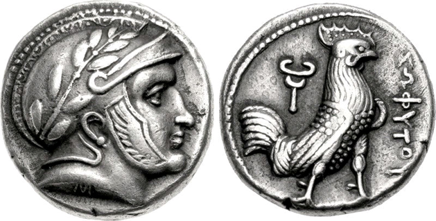
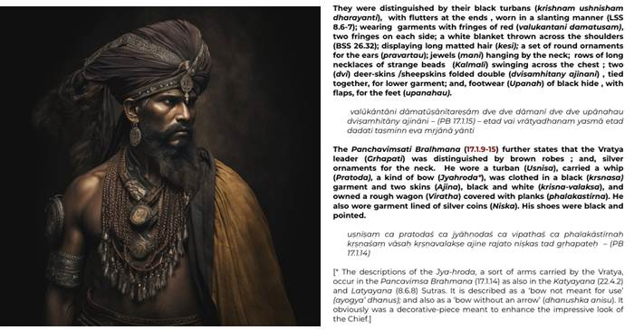

# The Sanskritization of the Silk Road

The heavy dominance of Indian culture on the Silk Road – both the overland one and the maritime one – is something that needs explanation. Vague narratives like “Brahmin approval allowed local kings to legitimize their rule” and “the local rulers were just so religiously influenced” don’t really make sense.

I think two basic factors explain the Indian domination of the Silk Road: _corporations_ and _medicine_.

### Re: Early Indian corporate rule in Bactria-Sogdia

One of the most pervasive themes of Indian history – and also perhaps the most underrated aspect in the modern study of it, although it was the very topic of RC Majumdar’s thesis – is the centrality of the _corporation_. State capacity was one of the three key weaknesses of Indian civilization – the other two being our insularity and our over-reliance on “Great Men” rather than developing robust institutions – and the efficiency of our corporations corrected for this.

Some additional notes on corporations. [[i]](#_edn1)

Mercenary corporations often came to rule countries – certainly within India proper, but also early Indianization in Central Asia was in part lead by Indian mercenaries employed by Iranic states, who then ascended in power and came to rule. We noted in “Early Iron Age Indian influences on the Mideast”, in the section on Kamboja, that this was probably already the case before the 8th century BC in Kamboja and Bactria (it should be noted that the Kurus themselves had become mercenaries – in that many mercenary tribes were called Kauravya, i.e. of Kuru descent – after their defeat by the Sālvas).

The Uttara-Kuru and Uttara-Madra attested in the Aitreya Brāhmaṇa and Vaṃśa Brāhmaṇa (certainly earlier than 500 BC) were also probably also such corporations that reigned in Central Asia although their locations are hard to ascertain. The Uttara-Kuru are also attested in Greek literature as the Ottorokorai (Attacori in Latin yields more such results), so they were definitely of Indian origin rather than an Indian term for a distant country. Interestingly their portrayal in later Indian literature – as “noble savages”, a society that was utopian despite it being “unfit for work” and sexually frivolous – also exactly agrees with the Greek description of the Hyperboreans, who are mentioned to be a “similar people” to the Attacori.

The most unambiguous reference to the prominence of Indian mercenaries in Central Asia is that of Sisikottos encountered by Alexander c. 328 BC. Sources and discussion in [[ii]](#_edn2), but briefly: Sisikottos was an Indian adventurer who ran a mercenary corporation, employed in Bactria and Sogdia; he initially opposed Alexander, but defected to him once Bessus surrendered – Alexander appointed him as satrap over the Aśvakāyanas (who at the time ruled the part of Gāndhāra West of the Indus river) – later during Alexander’s war with Porus, he received a report from Sisikottos that the Aśvakāyanas had rebelled and slain the Greek governor Nicanor; I tend to think this was a conspiracy by Sisikottos to break Alexander’s fragile supply line – Sisikottos then disappears from Greek mentions, and I think this is a cover for the fact that the Greeks actually lost their Northern supply line; instead a new figure “Meroes” or “Moeris” appears, who is the one to convince Porus to finally surrender, but also suddenly appears as the ruler of Sindh. If you suspect that this _Sisikottos Moeris_ is _Śaśigupta Maurya_ – a synonym to _Candragupta Maurya_ – I think you would be right.

Subsequently Alexander encounters a certain “Sophytes” – who is identifiable with the Saubhuta corporation mentioned by Pāṇini – he is placed by different Greek authors in the Amritsar/Lahore region or in Śākala – but then subsequently appears to have become a ruler in Bactria-Sogdia from 305–294 BC based on his coin finds.

_Greek-style coins of the Saubhuta king after becoming satrap of Bactria, with Greek legend “Of Sophytes”_

### Re: Indian states in Central Asia and the Steppes

### Re: China and the Medicine Theory of Everything for Indianization

### Re: Mongols, Japan, Korea

Early Interactions Between South and Southeast Asia: Reflections on Cross-cultural Exchange

"Preliminary Study of Indian and Indian Style Wares from Khao Sam Kaeo (Chumphon, Peninsular Thailand), Fourth - Second Centuries BCE"

Maritime Trade between Thailand and Bengal. Shahnaj Husne

[https://mea.gov.in/images/pdf/India-ChinaEncyclopedia_Vol-1.pdf](https://mea.gov.in/images/pdf/India-ChinaEncyclopedia_Vol-1.pdf) Encyclopedia of India-China cultural contacts

[https://twitter.com/Sapratha/status/1626146903024091136](https://twitter.com/Sapratha/status/1626146903024091136)

[https://twitter.com/Sapratha/status/1641054837986193408](https://twitter.com/Sapratha/status/1641054837986193408)

[https://mobile.twitter.com/Sapratha/status/1601117799694622722](https://mobile.twitter.com/Sapratha/status/1601117799694622722)

[https://twitter.com/Sapratha/status/1637143310853611522](https://twitter.com/Sapratha/status/1637143310853611522)

[https://twitter.com/Sapratha/status/1652245034081882112](https://twitter.com/Sapratha/status/1652245034081882112)

[https://twitter.com/blog_supplement/status/1652495008157642752](https://twitter.com/blog_supplement/status/1652495008157642752)

[https://twitter.com/Sapratha/status/1653325371079622656](https://twitter.com/Sapratha/status/1653325371079622656)

[https://twitter.com/localmathfanboy/status/1662012985014112256](https://twitter.com/localmathfanboy/status/1662012985014112256) armenia

## tales of Indian explorers

[https://twitter.com/arya_amsha/status/1339862413701627907](https://twitter.com/arya_amsha/status/1339862413701627907)

[https://vriitrahan.wordpress.com/2020/12/18/indian-traders-in-zanzibar/](https://vriitrahan.wordpress.com/2020/12/18/indian-traders-in-zanzibar/)

[https://twitter.com/GarudaJana/status/1285575617811853312](https://twitter.com/GarudaJana/status/1285575617811853312)

[https://twitter.com/GarudaJana/status/1260150714241880073](https://twitter.com/GarudaJana/status/1260150714241880073)

[https://twitter.com/porbotialora/status/1257441860265664513](https://twitter.com/porbotialora/status/1257441860265664513)

[https://twitter.com/arya_amsha/status/1647265675914756097](https://twitter.com/arya_amsha/status/1647265675914756097)

[https://twitter.com/Sturgeons_Law/status/1636487067151507458](https://twitter.com/Sturgeons_Law/status/1636487067151507458)

In the West – Armenia, Russia (Rahmans of Meenakshi Jain)

[https://economictimes.indiatimes.com/news/science/indians-used-own-cooking-pots-in-egypt-during-ancient-indo-roman-trade/articleshow/54911877.cms?from=mdr](https://economictimes.indiatimes.com/news/science/indians-used-own-cooking-pots-in-egypt-during-ancient-indo-roman-trade/articleshow/54911877.cms?from=mdr)

[https://www.jstor.org/stable/603404](https://www.jstor.org/stable/603404)

---

[[i]](#_ednref1) **Corporations**

Something worth noting is that corporate and republican systems were closely related – a republic was regarded as a “political corporation” – as you can see in the overlap of terms used by Kautilya and Pāṇini:

·       _Śreṇi_ – any corporation

·       _Saṅgha_ – any corporation or republic

·       _Gaṇa_ – a republic, but also a term used for guilds

·       _Rājaśabdopajīvinaḥ_ – corporations of whose chiefs took the title of Rāja; ruled in Vṛjika, Mallaka, Madraka, Kukura, Kuru, Pāñcāla

·       _Kṣatriyaśreṇī_ – mercenary corporations in KAS; ruled in Kamboja, Surāṣṭra

·       _Āyudhajīvi saṅgha_ – mercenary corporations in PA; ruled in Punjab (Vahika), in mountainous regions i.e. the Hindu Kush (Parvata), Bihar (the _Vrātyas_) or as Pūgas

·       _Pūga_ – I might be wrong, but I think this refers to itinerant communities

·       _Vrātya_ – a particular culture of warrior ascetics associated with Magadha and the Licchavi regions, with Shaivism, and with early Śramana schools like the Ājīvikas

·       _Vṛṣṇi –_ a particularly powerful culture of mercenaries originating in Mathura – they opposed the Magadhi imperial expansion for 150 years (before eventually falling to the Nandas), and spread the Krishna-sect far and wide in North-West India.

There are elaborate descriptions given of the Vrātyas in Vedic literature – [TheEmissary on Twitter](https://twitter.com/TheEmissaryCo/status/1607604933179723777?lang=en-GB) wrote some comments on them, and posted this MidJourney visualization.

 