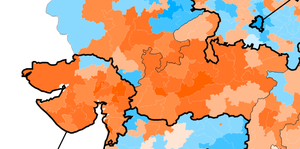
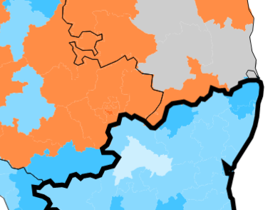
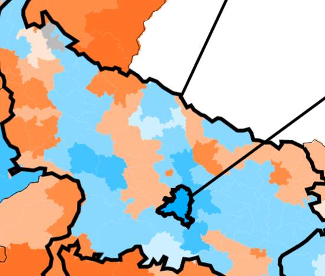

https://x.com/real_mahalingam/status/1797956765981851833

1) The worst part is this sends a signal to all kingmakers -- alliance parties, deep state bureaus, large corps, media/film industry, local strongmen -- that the BJP's rule isn't here to stay. The only way to save is for BJP to IMMEDIATELY make a display of power once it forms govt.

That means getting RG & Congress leadership on a helicopter, crackdown on all NGOs/funding sources. Make it clear to each kingmaker that defection will be their end. In BJP's carrot-and-stick to alliance-making, the stick was never big enough.

2) The loss was entirely the result of the opposition uniting. Again-- this is why allegiance to the Congress needs to be punished with fire. What this shows though, is that opposition voters *are* mostly united. BJP was never even their 2nd preference.

https://x.com/ShazCoder/status/1797939323859575189

3) But this does mean a lot of RWs will have to update their beliefs. E.g. UP was never the BJP stronghold that e-RWs portrayed it as. The Modi wave was never as strong as we'd like to think. And delimitation doesn't sound like a good idea anymore.

https://x.com/real_mahalingam/status/17979567659818518336

4) Extreme competence is still rewarded. Not everywhere; I don't think "good governance" and "development" sell in UP-- But Maharashtra, Karnataka, Rajasthan are redeemable. They could be turned into BJP strongholds if the BJP massively improved their competence there

5) Most "see, I was right" explanations are BS, because again: the vote share has been constant. Oppn uniting explains all of the observations. In any case, we can't punish any caste/region for voting wrong, because some decent % of them still voted right, and we need that %.

6) "Blame voters" "Blame party" It's not like voters had some noble reason to not vote BJP, but it's useless to blame voters because they're anonymous, so you can't punish them. You can (and should) only brutalize those who oppose you *vocally*.

7) Look at BLR, Delhi. Look at urban enclave constituencies like Lucknow. The BJP wins in cities, because caste consciousness is absent there. This election vindicated [@TheEmissaryCo](https://x.com/TheEmissaryCo)narrative about Jātitva being the single largest enemy to Hindutva.

8) The silver lining is that this means the most rewarding strategy for the BJP will also be what's best for progress:
- rapid urbanization 
- highly competent governance like in GJ & MP 
- full-blown authoritarianism against the opposition

---

https://x.com/real_mahalingam/status/1799107853204234719

My main belief update has been that RW has NOT captured the institutions as we had thought.

EC
Courts
Babus
Media, SM, Bwood
Academia
Street power

NONE of these have been captured. We're only at "Stage 2", as per quoted tweet-- which means they're all only loyal to us insofar

https://x.com/ShazCoder/status/1798302305227517988

as they believe we have power -- and so we only hold power as long as they believe we do, because electoral strength isn't all there is. And the election loss has reduced this level of belief. We still need to do the Long March Through the Institutions.

https://x.com/real_mahalingam/status/1799042368953598352

> I suspect that over the next 5 years, we will see that much of the right-friendliness from the media, film industry we've seen was a result of the confidence that Hindutva is here to stay as the official national ideology -- not any active authoritarianism/govt intervention.

Street power -- Sangh needs to pick up. EC, courts, babus, Bwood, news media -- Govt has to do this.

Academia Social media Even news media to an extent -- folks like us can do this. Demolish the credibility of existing institutions, develop seriously competent alternative ones. I'll start building Pramana in the next few weeks.

https://x.com/real_mahalingam/status/1775118813891002864

Dhruv Rathee's game is to play middle man between Western shitlib discourse and the dehat.

We need to build a similar RW figure

Or get existing popular RW-sympathetic influencoors and surround them with ministers possessing ideas and strategy.

https://x.com/shrikanth_krish/status/1798720113237254362

"Middleman between intellectuals and the dehat"

Historically, such a figure has been known as a "king". This should tell you the importance of this. 

But most kings are useless, and can barely hold onto their own forts, let alone conquer. E.g. America's conservatives have really

useless kings like Ben Shapiro, who only exist to perform for their own audience and try "debating" his enemies, the effect of which wears off once they grow up because they never understood his arguments in the first place and his personality never left an impression on them.