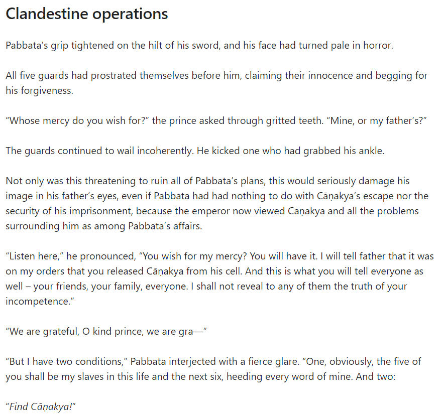
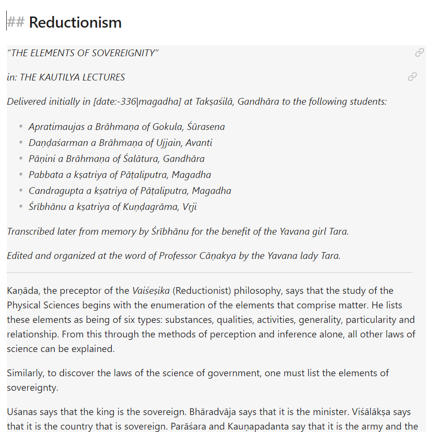
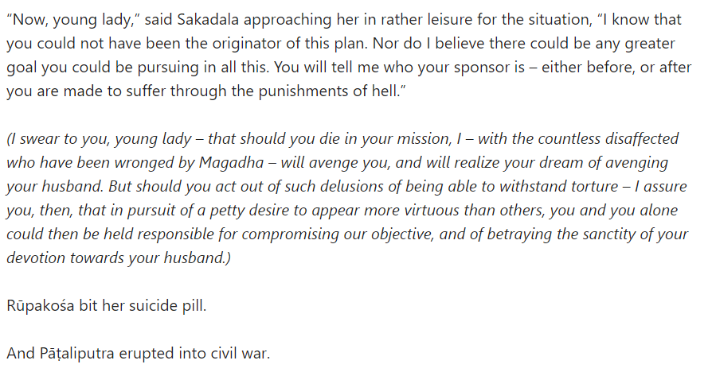
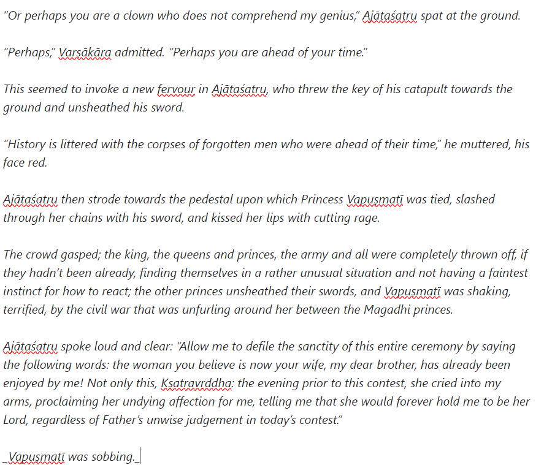
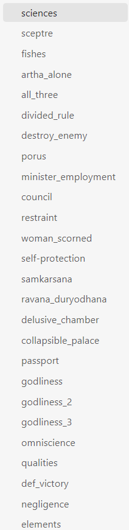
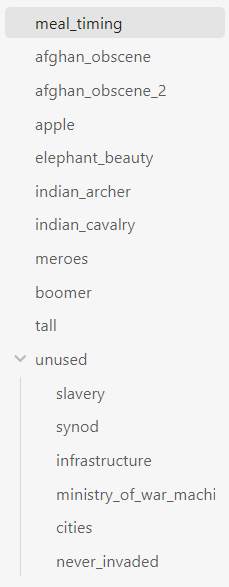
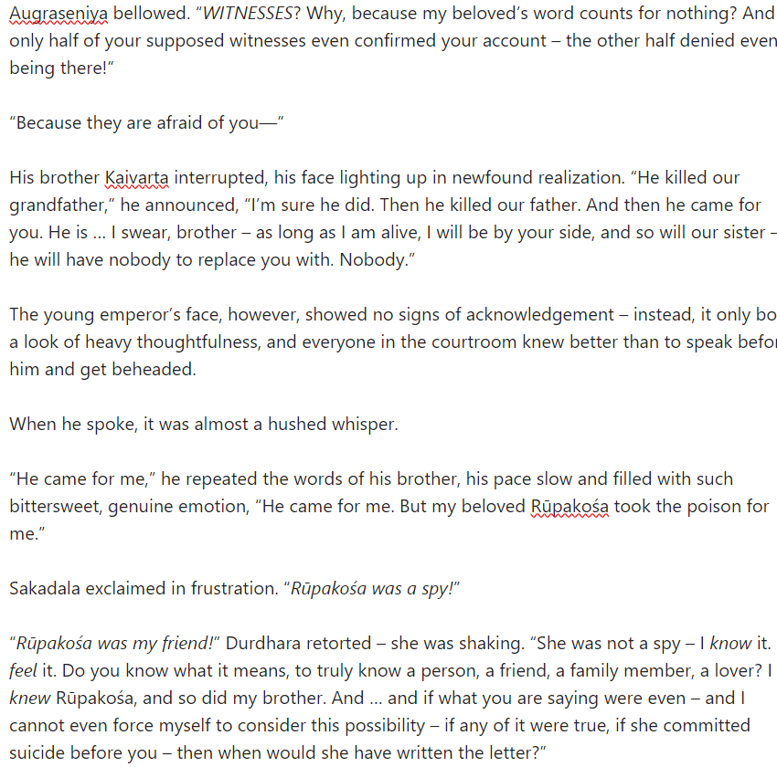
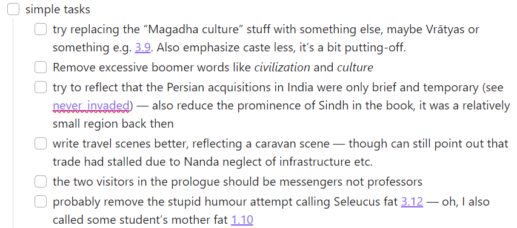
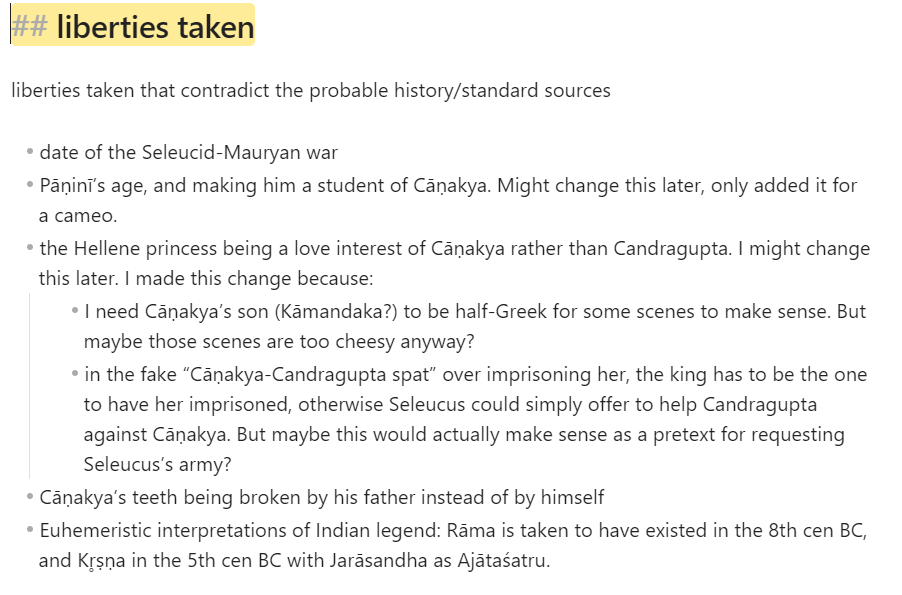
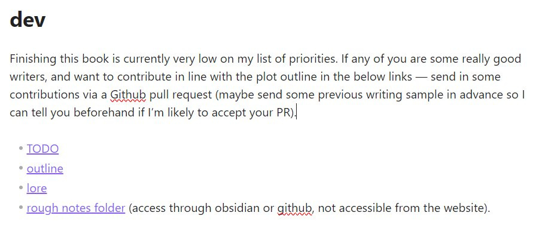

Excerpts from some historical fiction I wrote (on the rise of Kautilya/the Mauryas) 2 years ago.

It's only about 65% done, and it has a bunch of ugly things I’m no longer proud of, but it's better than most Indian historical fiction/fantasy out there.

---

Besides the fiction it also contains a really nice index of interesting Arthaśāstra quotes, and quotes from Greek accounts about India.

BTW making the Arthaśāstra compulsory reading would be the single most effective intervention to raise the level of our culture. 

---

Just turned it into a Github repo: github.com/srajma/book/tree/master

The nicest way to read it right now is by downloading Obsidian (which you should do anyway, it’s a fantastic app) — for a quick preview see:

https://srajma.github.io/book/

---

Disclaimers:

---

And as usual, I'd be happy to take contributors (co-authors? lol).

