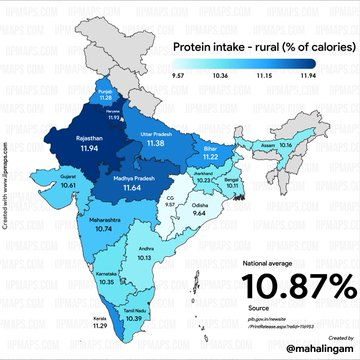
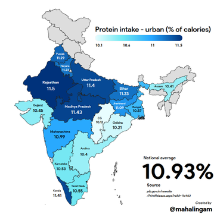
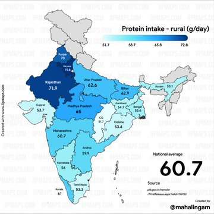
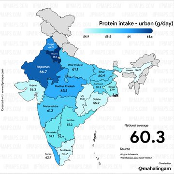
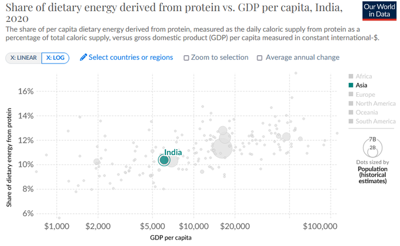

https://twitter.com/real_mahalingam/status/1708481807123948007

This tiring veg non-veg debate will never end, but I will do my best

1. Yes, Indian protein consumption (10% of total calories) is lower than optimal (20%). 
2. India's more vegetarian states actually do slightly better on this: (cc: [@indiainpixels](https://twitter.com/indiainpixels))

3. Instead, our protein consumption is entirely explained by our income level. 
4. However, it _is_ true that a vegetarian diet cannot provide the requisite 20%, unless it contains skim milk, eggs or protein powder (or soy, but that's cringe), because all other veg foods, including whole milk, are <= 20% protein. 

5. Dietary advice for upper and lower class Indians should be very different. For the poor, by far the main cause of poor health outcomes (malnutrition, stunting) is low overall caloric intake and micronutrient intake.
6. For the upper class, standard Western hippie advice is applicable: legumes, mustard/olive oil, pomegranates/berries, onion/garlic/cruciferous veg, nuts etc.
7. There are many good things about the Indian diet, and in vegetarianism, with regards to cancer prevention and neurodegenerative diseases. I would not throw the baby out with the bathwater.
8. If you do eat meat, let it be fish. The fact that Indian BPs don't advocate for this or any other high-value improvements (pts 5 and 6) and go straight to beef/pork is extremely sus.

---

The main reason I don't like the "Indian diet bad" takes is that "Indian food" is a very flexible category. The only meaningful sense in which "Aloo Gobi cooked in Sunflower Oil" is Indian is its spice palette, which is the only good thing about that dish.

If your take on the Indian diet isn't eat less rice/potatoes, eat more nuts and legumes, cook in MUFAs and get 20% of your calories in protein 

but instead 
yOu mUSt EAT beAF BuRGEr 

you don't actually care about health and fitness, you just have mommy issues.

Indian spices are good. Legumes are good, and the Indian legume palette is uniquely palatable. *Most* diets were historically carb-dominated, until countries got rich. The famed Italian diet still is. This isn't something that can't be fixed. See also:

---

It's not that hard. The basic macro guidance for vegetarians should be: Let legumes, rather than grains, be the basis of your diet, eat at least 600 calories worth of dairy (ideally non-fat) or eggs, cook in mustard oil, eat a ton of f&v (starchy vegs don't count), eat 50g nuts.

Micro guidance would be: among fruits, eat pomegranates/darkly-colored things among vegetables, eat greens (and cruciferous if you can afford it) and raw onion/garlic among nuts, pick walnuts (and chia/flax if you can afford it) eat spices other than cumin & coriander.

