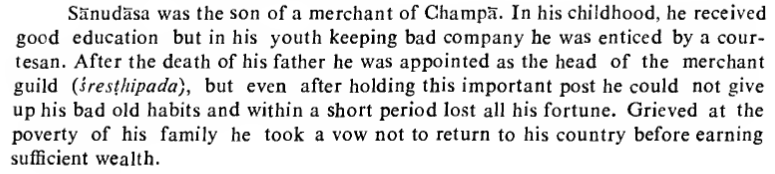

https://twitter.com/real_mahalingam/status/1689312152996204544

Tales of explorers and merchants often faded into oblivion in Indian literature, due to our historic priorities. One notable exception is the tale of Sānudāsa, a prodigal son who takes to the seas to make up for all the family wealth he's squandered.

He is shipwrecked on his journey West. Previously shipwrecked on the island a girl by the name of Samudradinna. Her mother was Greek, so no man in India would marry her. Thus her (Indian) father had taken her to Alexandria to find her a groom, but was killed in the shipwreck.

Sānudāsa agrees to marry the half-Greek girl, they make a distress signal, and are rescued by a ship returning to India. Then the ship gets wrecked somewhere on the Tamil coast and his new bride dies (or is "washed away").

Sānudāsa makes it to Madurai with the help of a bilingual man, and ultimately makes some wealth and returns to Champa (East Bihar). But his wanderlust is not satiated, and he takes off for South-East Asia (Suvarṇabhūmi).

Here the tale takes a somewhat mythical twist: the merchants travel first to the Goat Path in Central Asia, where they dress up in goat hides and await giant birds to carry them off to South-East Asia. The End.

