https://twitter.com/real_mahalingam/status/1691474905315889152

Earliest recorded Indian rulers in Southeast Asia:
 - Kaundinya, Cambodia, 1st cen 
 - Śrī Māra, S. Vietnam, 1st/2nd cen
 - Deva-varman, Java, 132 AD
 - Langkasuka, Malaya, ~100 AD 
 For SEA to be so fully Indianized in the 2nd cen, trade and influence must have began much earlier.
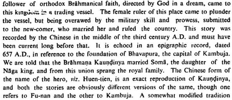

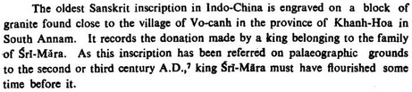

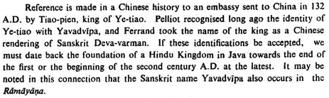

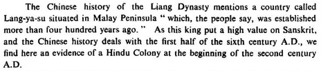

Founding legends of other Southeast Asian countries, other than the famous Kaundinya: - Langkasuka, Malaya by a Mauryan prince - Java, by a Kuru prince through Gujarat - Sankissa, Upper Burma by Abhirāja of Kapilavastu - Thaton, Lower Burma, by Mauryan-era Andhra explorers

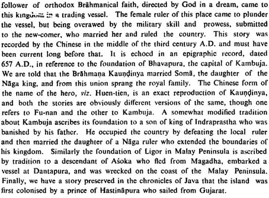

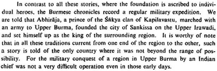

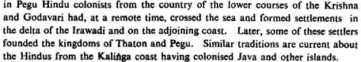

Oc-eo in Vietnam was an Indian trading colony from ~200 BC, and later part of Kaundinya's kingdom in the 1st cen. It was an important stopping point on the journey from India to China, and notably hosted the Romans in their first embassy to China (120, 166 AD).

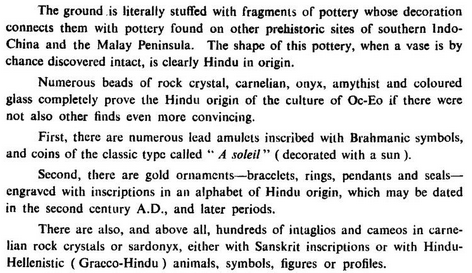

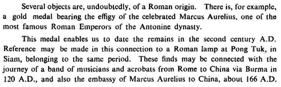

Indian-Chinese maritime trade began in the 2nd cen BC. As Chinese vessels were too low-quality at the time to pass through even Vietnam, Indian vessels made basically the entire journey, thus providing the impetus for the Indian colonization of SEA.

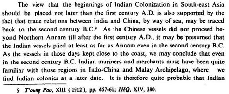

Other early Indian trading colonies in SEA. Pre-Indian Southeast Asians were primitive in many ways but they were extremely competent mariners. Although they are classified as neolithic, they used iron.

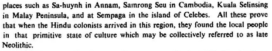

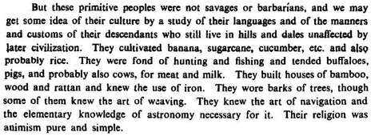

Majumdar strikes down in two pages all the wordceling of other historians, like: 

* overstating the importance of pre-Indian SEA cultures
* claiming that Saka invasions drove Indians to SEA
* all the standard simping for Buddhism

Based.

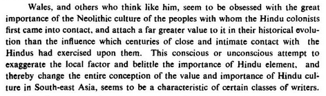

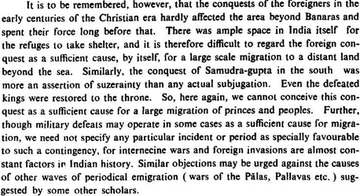

Chinese texts say that Indian ships were much larger than theirs. (Majumdar says here that the Greeks discovered the monsoon winds: we now know they learned it from Indian sailors, who learned it from neolithic tribes from Konkan and Baluch who preserved ancient IVC knowledge)

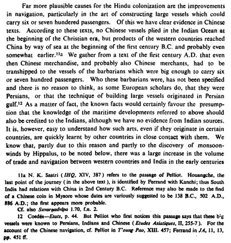

Funan and Campa expanded into formerly Chinese-controlled territory. By c. 350 they had conquered up to the "Hoan Soanh" mountains. I can't find anything about these mountains (they're not the Huangshan), it's 1979 lingo, but probably somewhere in North Vietnam.

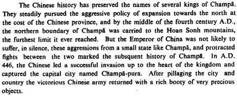

Indianization in SEA suffered a set back in the Gupta period, and was re-invigorated in Funan by Kaundinya II c. 410, and by extensive Pallava involvement. Funan would fall in the 7th century, giving rise to the era of empires like Śrīvijaya, Śailēndra, Yaśōdharapura (Angkor).

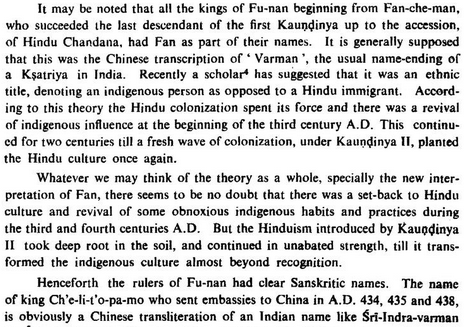

Source: Ancient Indian Colonization in Southeast Asia by RC Majumdar. [http://archive.org/details/AncientIndianColonizationInSouthEastAsiaRCMajumdar](https://t.co/W1zKGSry2c) 

Summary map, a bit messy:

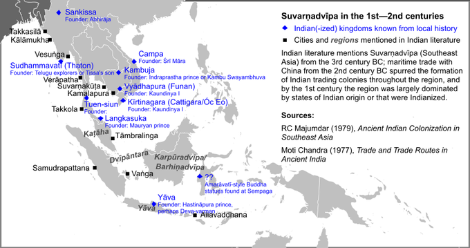

