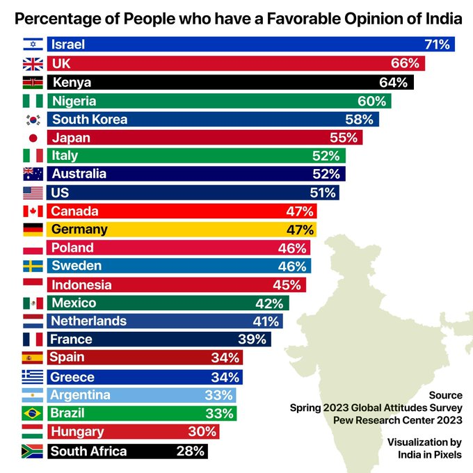

**The Indian RW needs an Official Party Line.**

Our greatest strength is the horde. But the horde is r-tarded and self-sabotaging.

Elites will decide the party line, and disseminate it to the horde.

Read on if you’re interested in working on this.

Problems with the RW🧵

---

1. Lack of ideological conviction

We will say whatever “wins” the argument —or repeat a grifter intellectual— without regard for truth or polarity.

“Hinduism feminist religion we are nature worshippers!”

or this guy citing LW quack science to call himself genetically inferior:

---

This is made worse by Indians having no idea who their allies are.

You’re not going to curry the left’s favour. They already hate you.

You’re not going to “exploit white guilt”. “White guilt” is just performative contrition to feel superior, you're too autistic to get it.

---

All this sort of argument accomplishes — REEEing about “Abrahamic”, “colonialism”, “Hinduism most progressive religion” — is that you lose every value you’re fighting for, become a loser, and make yourself look like a pvssy in the process.

---

2. Lack of knowledge.

a) Lack of knowledge about policy, Hinduism.
b) Lack of knowledge about our enemies and their tribes (no, the neckbeard at NYT REEing about Modi isn’t a Xtian missionary)
c) Innocence about what’s written in our texts.

https://twitter.com/noconversion/status/687141798632796161

---

I propose: Śri Janpuṅg Thought.

An dictionary of {topics : takes}. Each topic will show a multitude of opposing takes from different RW Intellectual Elites on Twitter like myself.

Smart RWers can also use this for copypasta. And we can make bots.

---

3. Making up BS is easier than fact-checking

TI can't forever scour ASI reports from 1900 to debunk every random claim from JNU quacks

We must build an indexed searchable digitized library of sources, with internal referencing, and an army of RAG bots.

https://twitter.com/TrueIndology/status/1774507726573367450

---

Here’s an incomplete list of primary sources I’ve been listing out, and some precise desiderata I wrote earlier for such a portal.

https://srajma.github.io/drafts/Articles/sources/primary.html

---

4. We don’t know how to speak outside the in-group.

Every RW attempt at develop alternative institutions to mainstream history academia, wikipedia etc. end up in something entirely useless, because no one undecided will ever read it, nor will be convinced if they do. E.g.

---

Instead our basic content must be politically neutral & free of commentary. All claims directly and transparently referenced.

Add to that some good meme game against the relatively poor epistemic standards of our rivals, and we can make Wikipedia University look like a joke.

---

5. We’re easily manipulated.

Take how easily many of our own bought the M-run “Jeetas posting Ls” account.

Or e.g. a single e-girl’s remark turning all of H twitter to seethe against the one country that actually likes us the most.

https://twitter.com/Prateek_Aaryan/status/1774748933354643656

---

If one e-girl is all it takes for y’all kids to burn bridges with what in the adult world is our most reliable ally, then yeah no one’s going to want to be your friends.

We need an allies list, and an index of confirmed & suspected fake or misrepresentative accounts.

---

I won’t have time this week to start working on this — maybe a bit next week, and more significantly toward the end of the month.

I probably will need a team though. Q: is there an algorithmic way to do Sanskrit segment analysis like wisdomlib or the Pāṇini Research tool do?

---

Would be useful for Pramana.

https://sanskritdictionary.com/panini/
https://www.wisdomlib.org/sanskrit/segments/ni%C5%9B%C4%81ntapra%E1%B9%87idhau

---

Fellow Intellectual Elites whose takes I would like to include in OPL:

@hindookissinger thought
@sapratha
@Rjrasva
@TheEmissary
@dhanyavisnu
@shrikanth_krish
@IgnorantBoh
@arya_amsha

Permission (to have some schizos go through your tweets and stick them to a website) plz