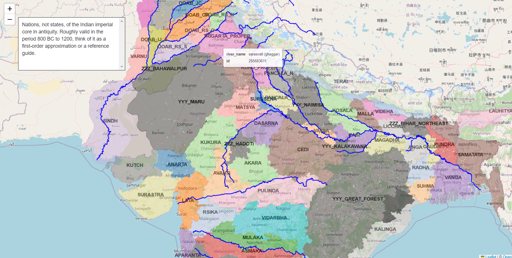
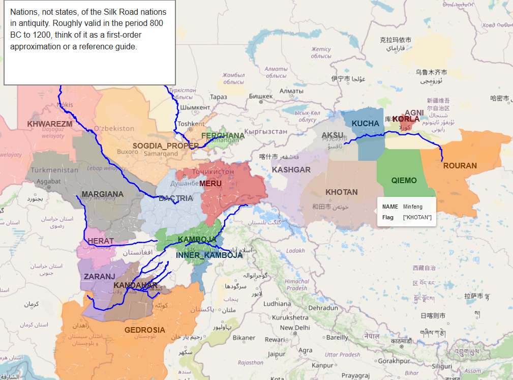
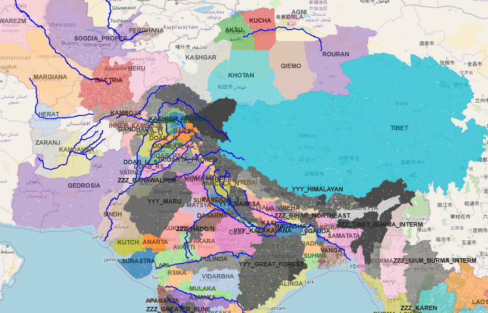
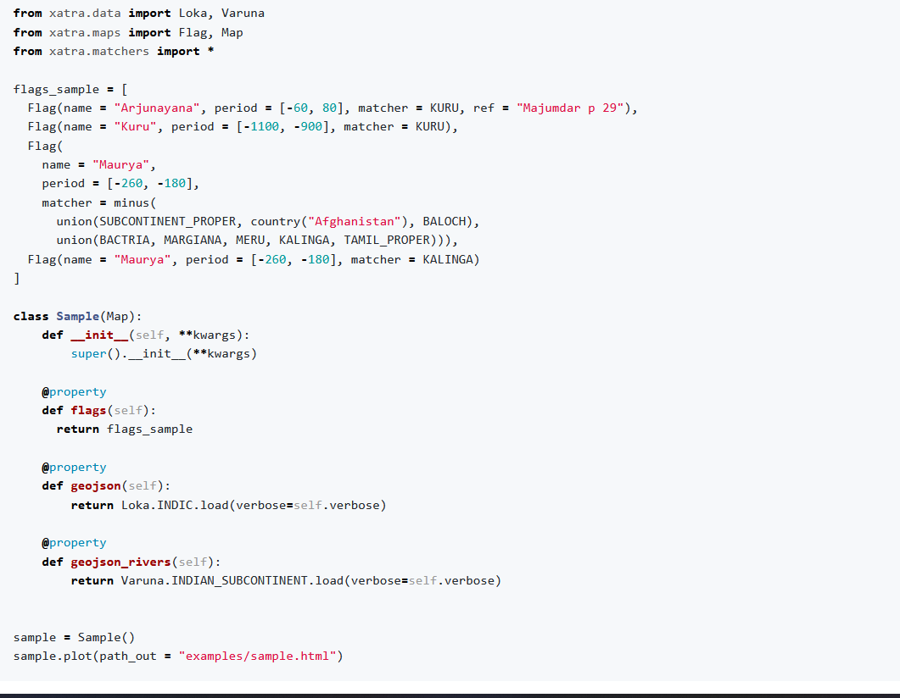

https://twitter.com/real_mahalingam/status/1766657608788664483
# pip install xatra: a Python package for building historical maps

Announcing the alpha version of `xatra`, a small Python package for building historical maps.

To use, just run `pip install xatra`.

---

The idea is you specify a map by a list of "flags": declarations that a certain polity ruled over some region. A Minimal Working Example of how you would use the package:

---
It's not the prettiest, and its handling of dynamic (year-wise) maps is currently quite inefficient. I would be *very* happy to have some collaborators:

github.com/srajma/xatra

For the time being, it at least simplifies things compared to editing in inkscape for hours on end.

---

Besides my followers, might be of interest to: @gandaberunda4, @hindookissinger @prathgodbole @sapratha @arya_amsha @dhanyavisnu @ilustratedIndia

